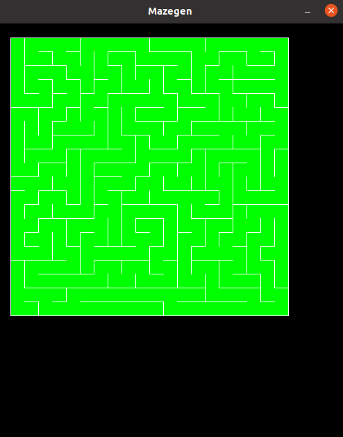
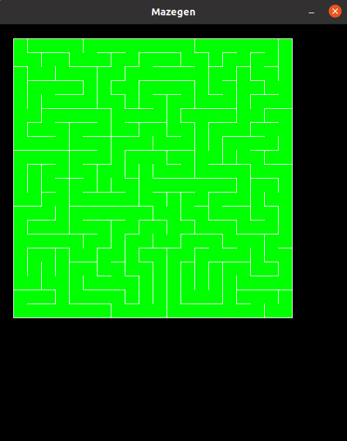

[//]: <> (**!! Atenção: Renomeie o seu repositório para \(Tema\)_\(NomeDoProjeto\). !!**) 

 
[//]: <> (**!! *Não coloque os nomes dos alunos no título do repositório*. Exemplo de título correto: Grafos2_Labirinto-do-Minotauro !!**)

# Mazegen

**Conteúdo da Disciplina**: Grafos

## Alunos
|Matrícula | Aluno |
| -- | -- |
| 17/0041042  |  Marcos Gabriel Tavares |
| 16/0152615  |  João Pedro Elias Moura |

## Sobre 
O Mazegen gera um labirinto 20x20 utilizando um algoritimo DFS modificado que ao invez de iterar todos os vizinhos em ordem, seleciona um aleatoriamente. Grade de grafos gerada utilizando networkx. Futuro objetivo: Adicionar opção de input de dimensão do labirinto.

## Screenshots

## Instalação 
-- Ter python3 na maquina
-- Ter o modulo venv("sudo apt install -y python3-venv
")
-- Clonar o repositorio
-- Ativar o ambiente através de "source my_env/bin/activate"
-- Executar "tela.py" com o comando "python tela.py"

**Linguagem**: 
Python

**Framework**: 
Pygame

## Outros 

Referencias:
https://github.com/tonypdavis/PythonMazeGenerator/blob/master/pygame%20maze%20generator%20with%20solution.py
https://www.baeldung.com/cs/maze-generation

